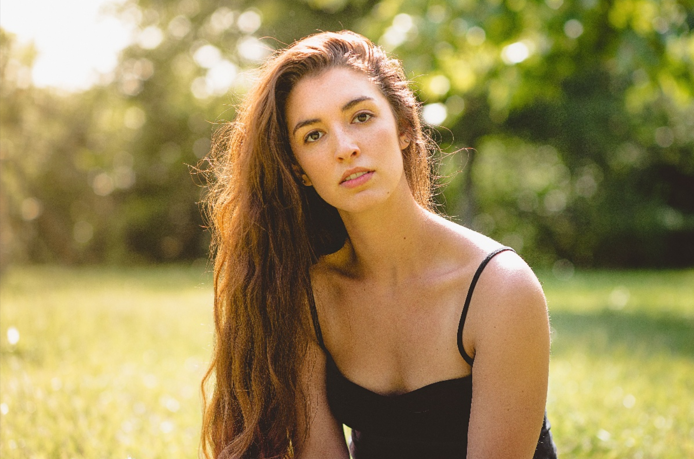
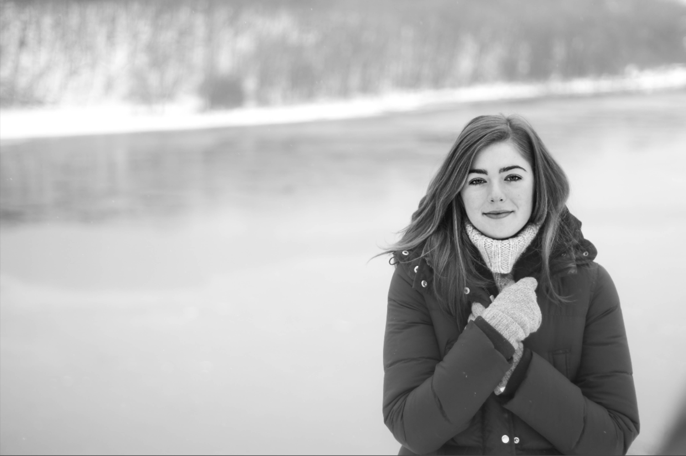
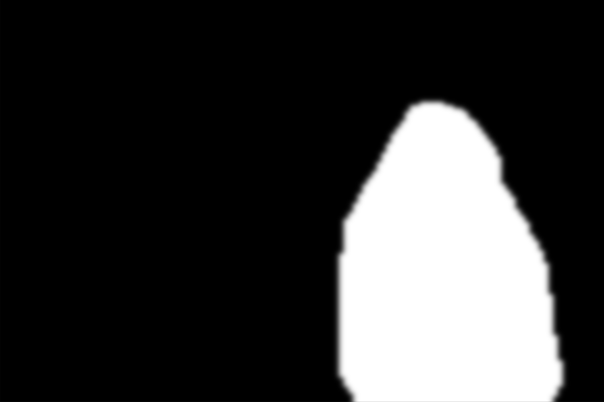

# Person segmentation model

By Jonah Krueger, Noah Kawleski, Tomas Santana and Alex Berg

Based on the [UNET](https://arxiv.org/abs/1505.04597) architecture, this model is trained to mask out people in images. The main goal of the model is to be as lightweight as possible while still achieving good performance. Implemented in PyTorch.

The model is trained on the [Supervisely Human Segmentation Dataset](https://www.kaggle.com/datasets/tapakah68/supervisely-filtered-segmentation-person-dataset) and the [Selfie Image Detection Dataset](https://www.kaggle.com/datasets/jigrubhatt/selfieimagedetectiondataset). The selfie dataset didn't have masks, so those were generated using YOLOv8.

## Running the program

To run the model, you need to install the required packages. First make sure you have your desired pytorch version installed. Then run:

```bash
pip install -r requirements.txt
```

You can run the test webcam demo with:

```bash
python -m src.test_webcam
```

## Training the model

To train the model, your dataset should have an `images` and a `masks` folder. You can change the dataset path in `src/config.py`. 

Before using your dataset, your images should be resized to 128x128. We have included a script to do this in `src/preprocessing.py`. You can run it with:

```bash
python -m src.preprocessing
```

To train the model, run:

```bash
python -m src.train
```

## Results

The model achieves great results in images with simple to moderately complex backgrounds and simple poses. The model struggles with more complex backgrounds and poses. Its ideal usage is as a videocall background filter, which is why we trained on selfie images. It is able to run at 30 FPS on low end hardware (AMD Ryzen 5 6600U).  We added a lot of image postprocessing to make the results look better. In particular, we use morphological operations to remove small noise and fill in holes, we also add dilation and gaussian blur to make the mask look smoother. 

### Example images

| Input | Mask |
|-------|------|
|  |  |
|  |  |
